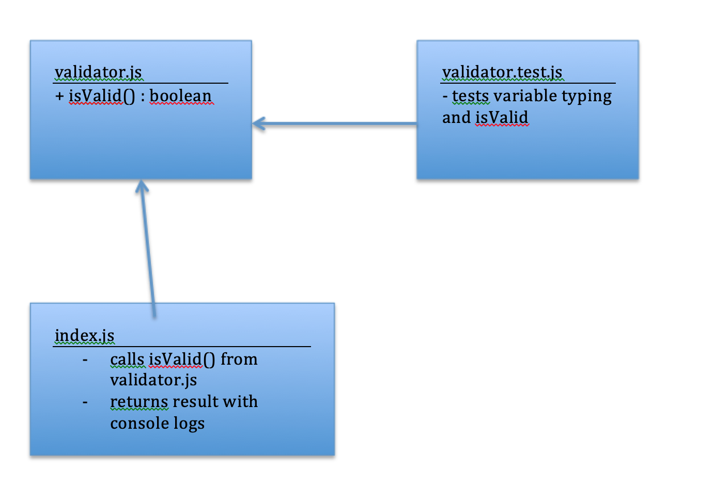

# LAB - Node Ecosystem (01)

## Doing Stuff with TDD

### Author: Earl Jay Caoile

### Links and Resources
* [submission PR](https://github.com/js-401n15-eoc/lab-01/pull/1)
* [GitHub Actions](https://github.com/js-401n15-eoc/lab-01/actions)

#### Documentation
* [MDN docs](https://developer.mozilla.org/en-US/docs/Web/JavaScript/Reference/Global_Objects) (Global Objects)

### Setup
#### Tests
* Testing command: `npm test`

#### UML
